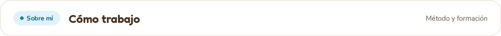
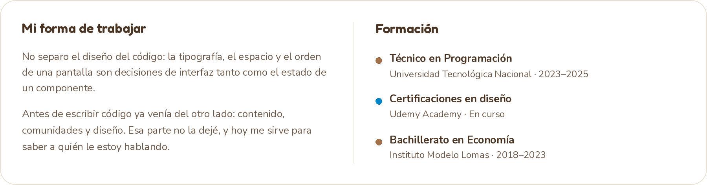
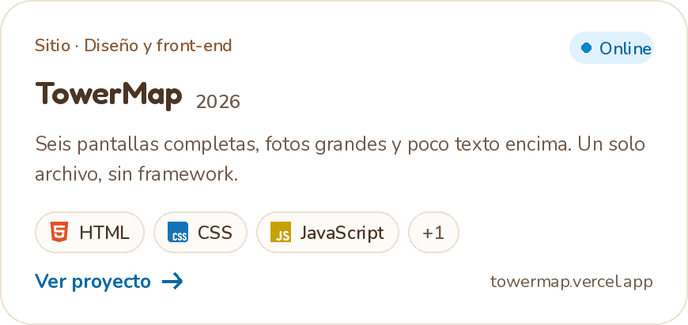
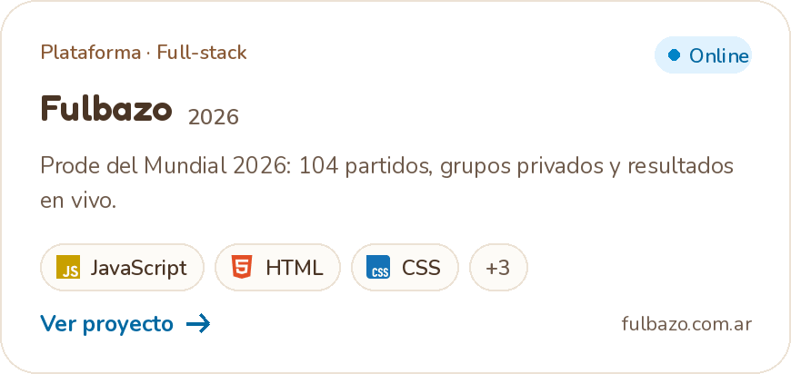
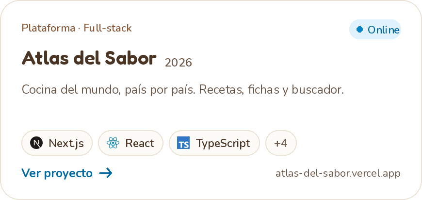
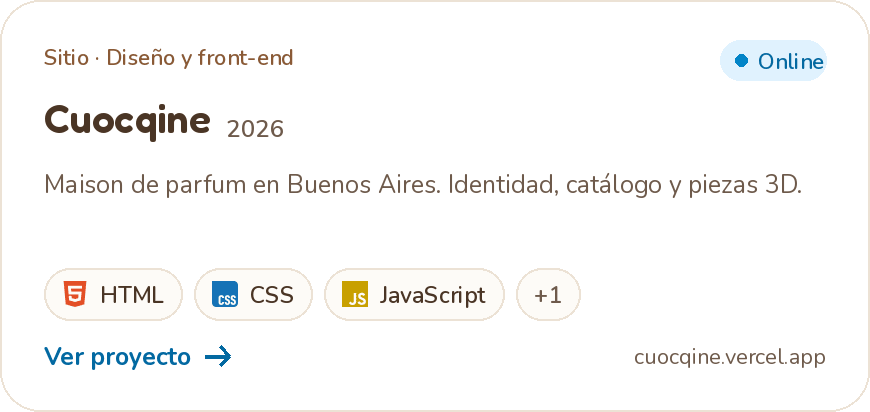
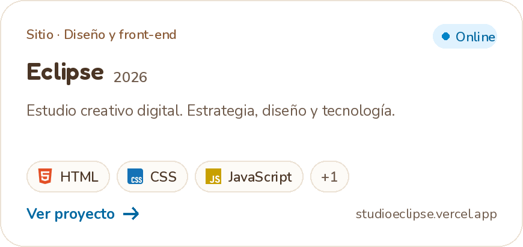
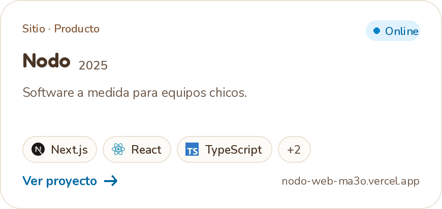
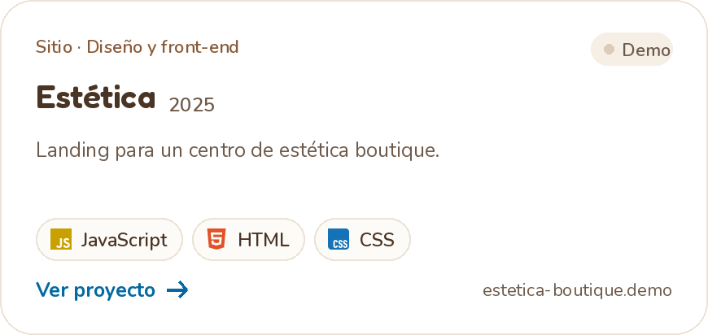
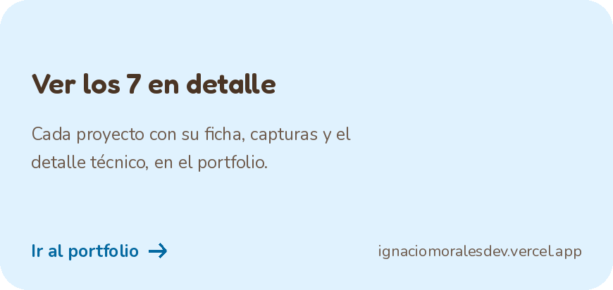

  
  &nbsp;
  
  &nbsp;
  

Programo desde los 15. Me formé como Técnico en Programación en la UTN y lo que más disfruto es llevar una idea de cero a tenerla funcionando en producción.

 

 

 

<table>
<tr>
<td width="50%"></td>
<td width="50%"></td>
</tr>
<tr>
<td width="50%"></td>
<td width="50%"></td>
</tr>
<tr>
<td width="50%"></td>
<td width="50%"></td>
</tr>
<tr>
<td width="50%"></td>
<td width="50%"></td>
</tr>
</table>

 

¿Un proyecto, una búsqueda o una idea dando vueltas? Escribime por donde te quede más cómodo. Respondo todos los mensajes.

**[ignaciorodolfomorales@gmail.com](mailto:ignaciorodolfomorales@gmail.com)** &nbsp;·&nbsp; **[in/ignaciomoralesdev](https://www.linkedin.com/in/ignaciomoralesdev/)** &nbsp;·&nbsp; **[ignaciomoralesdev.vercel.app](https://ignaciomoralesdev.vercel.app)**

 

