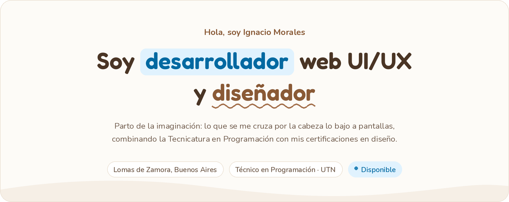
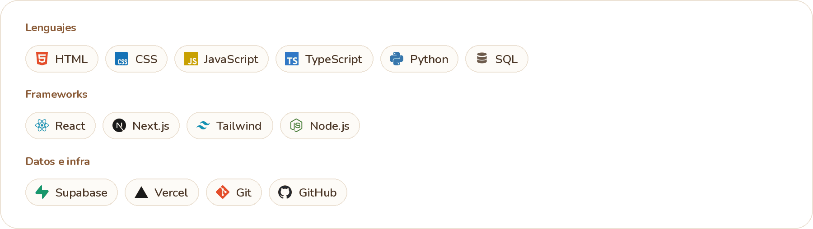
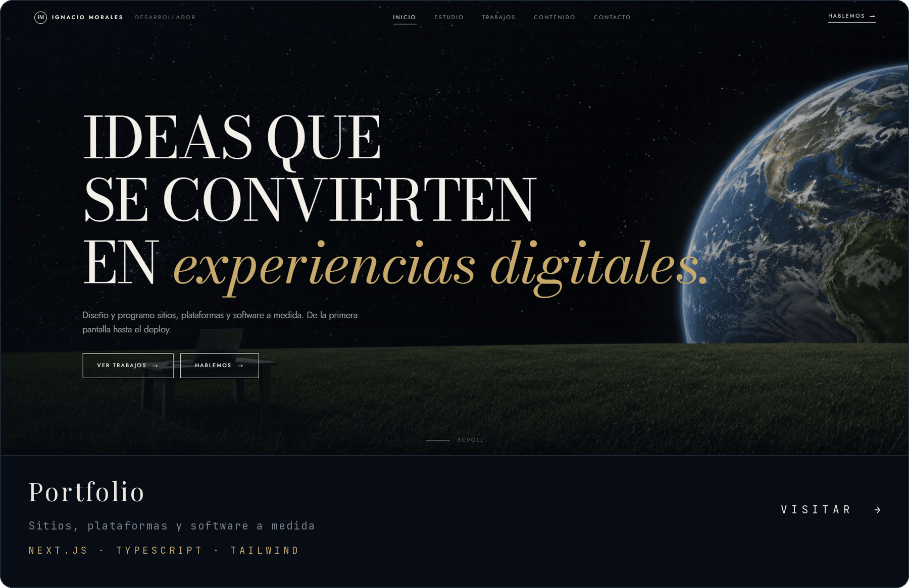
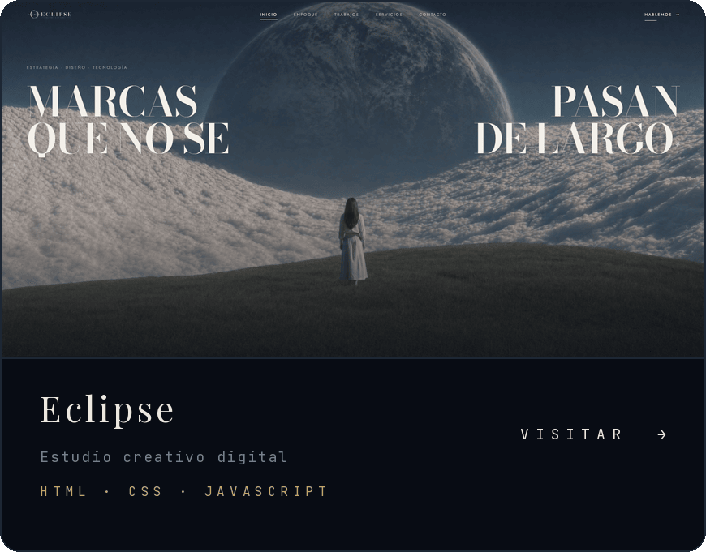
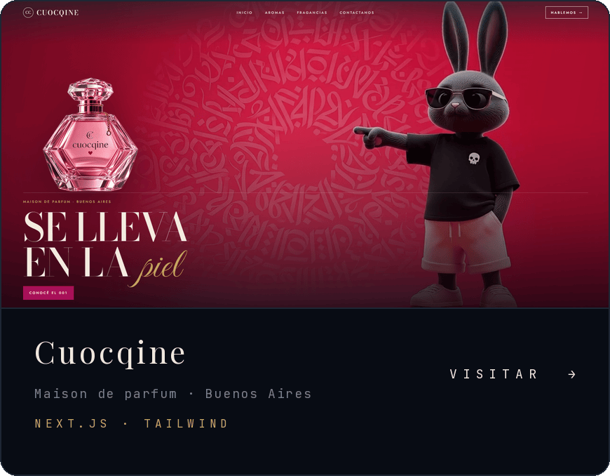
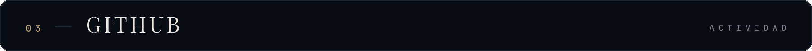

  
  &nbsp;  &nbsp;  
 
  

Programo desde los 15. Me formé como Técnico en Programación en la UTN y lo que más disfruto es llevar una idea de cero a tenerla funcionando en producción.

No separo el diseño del código. La tipografía y el ritmo de las pantallas son decisiones de front-end tanto como el estado de un componente, y cuando las dos cosas las decide la misma persona el resultado se nota.

Busco mi primer rol como desarrollador. Junior, pasantía o freelance.

    
También trabajo con React · Next.js · Node.js · Supabase · Vercel
   

<table> <tr> <td width="50%">  </td> <td width="50%">  </td> </tr> </table>
Proyecto			
Fulbazo	Plataforma del Mundial 2026: 104 partidos, ranking, grupos privados y chat en vivo	Next.js Supabase TS	Visitar →
TowerMap	Estudio de arquitectura de montaña en la Patagonia	HTML CSS JS	Visitar →
Atlas del Sabor	El atlas vivo de la cocina mundial	Next.js Supabase	Visitar →
Ferretería	Control de stock para un depósito	Python SQL	Visitar →
Nodo	Software a medida	Next.js Tailwind	Visitar →
¿Dónde comemos?	Guía de restaurantes de la zona sur	React Tailwind	Visitar →

Los nueve proyectos, con ficha y capturas, en ignaciomoralesdev.vercel.app.

   
   
   

Un proyecto, una búsqueda o una idea dando vueltas. Escribime por donde te quede más cómodo.

ignaciorodolfomorales@gmail.com  ·  in/ignaciomoralesdev  ·  ignaciomoralesdev.vercel.app

  
